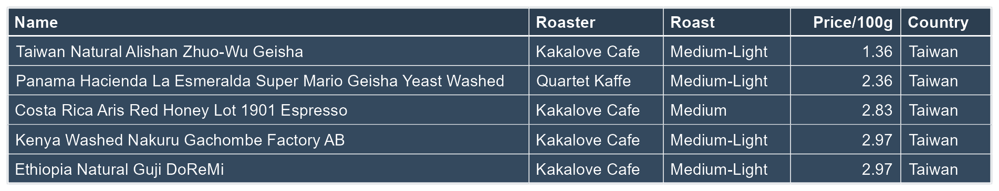
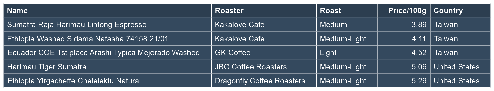

```{r setup, include = FALSE}
gc()
rm(list=ls())
library(tidyverse)


list.files('code/', full.names = T, recursive = T) %>% as.list() %>% walk(~source(.))

d <- clean_csv_import("data/Coffee/Coffee.csv")
```
# Categorizing coffees by matching the words SU students used to describe coffee that they like to reviewer descriptions.
```{r}
d <- coffee_cat(d, sweet_words = c("sweet", "chocolate", "cocoa", "honey", "caramel", "molasses","syrup", "vanilla", "syrupy", "butter"),
                       fruity_words = c("fruit", "tart", "zest", "bright", "juicy", "lemon", "peach", "orange", "grapefruit", "strawberry", "blackberry", "mango", "cherry", "apricot","currant"),
                       bold_words = c("savory", "spice", "roasted", "dark", "cedar", "tobacco", "baker", "sandalwood", "espresso"),
                       nutty_words = c("almond", "hazelnut", "smooth", "velvety", "rich"),
                       floral_words = c("floral", "jasmine", "lavender", "rose"))


```


Cleans and translates the map data.
I used Claude to map all the origin regions to country names that I can use that map package.
```{r}
d <- d %>%
  origin_clean()    # Cleans and translates the map data
```

```{r}

coffee_value_map(d)

```


 I want to show how different coffee's rating changed based roast and price categories
```{r}
filtered_d <- d %>% filter(roast %in% c("Medium-Light","Medium","Light"))

box_plot(
  df         = filtered_d, 
  x_var      = Cost_Per_100g,   
  y_var      = Rating,          
  facet_var  = roast,           
  median_var = Rating          
)
```

Now that we know that that there is a lot of highly rated coffees that are very cheap, we need to find the sweet spot of quality and affordability.
```{r}
scatter_price_per_rating(d,
                         ratings = 90:97,
                         roasts = c("Medium-Light", "Medium", "Light"),
                         categories = c("Sweet & Comforting", "Fruity & Vibrant"),
                         n_cheapest = 5,
                         title = "5 Cheapest Coffees per Rating Level", 
                         color_palette = "Dark2")
```

# Recommendation tables
I added these tables to provide the entrpreneur of a finite list of options to choose from.
```{r}
export_rating_table_png(d,95, "figures/5cheap95.png")
export_rating_table_png(d,96, "figures/5cheap96.png")

# Display them in the output


```

