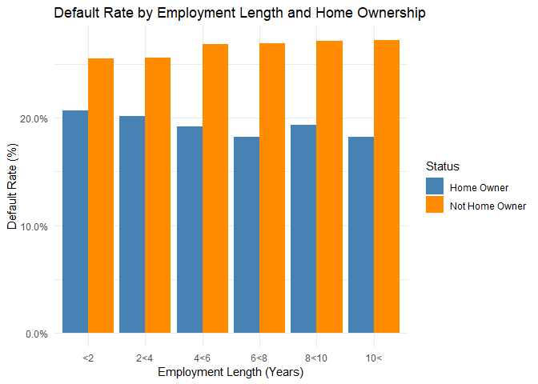
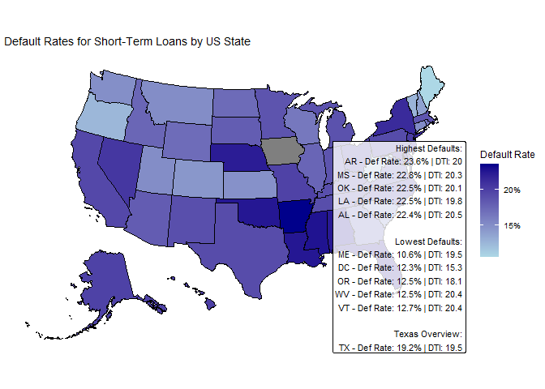
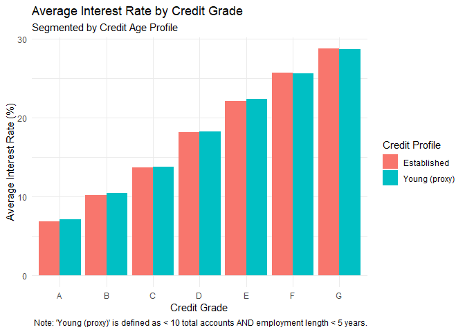
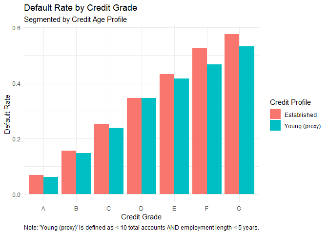
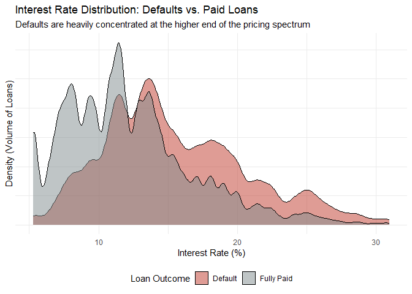
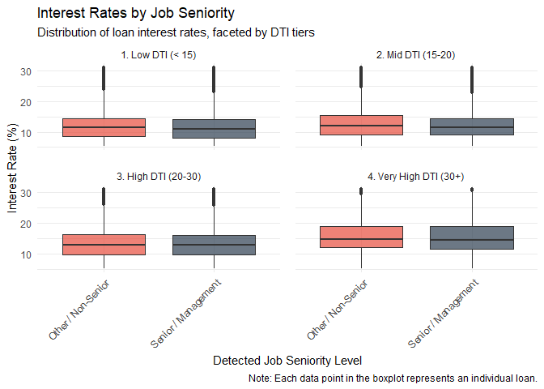

Question3
================
Martin Raubenheimer
2026-06-18

I wanted to generate a function that illustrates the differences in POD
for home owners and non-home owners, and young people versus old.

- different categories easily illustrate differences as well as
  different bars for home owners

- filtered for short-term loans

``` r
emp_length_bar(d)
```

<!-- --> This
graphs tells us two different stories. 1. That home owners tend to have
lower default rates than non-homers. 2. This gap actually increases as
people have been longer employed. The lowest default rate seems to be
people who have been employed between 6 and 8 years and owns a home.

# State level

I like maps. Wanted to show how state differ so after the default rate
is calculated, “usmap” package installed, I only have to set
transparency by default rate.

Hard numbers give a clear view so I added the tables of the states with
the 5 lowest and highest default rates and added there respective
average DTI’s.

``` r
short_map(d)
```

<!-- --> From this
map we can clearly see that the states with the highest default rates
are grouped together down South. While generally the North-West has less
defaults with “” having the lowest default rate. Very interestingly DTI
levels does not seem to have to great of an impact on defaults.
Louisiana has a default rate is higher by 10 percentage points than
West-Virginia, but West-Virginia has a higher DTI. So at least on the
National level there is no hard level DTI caps, if so there would be no
country roads taking you home to the place you belong. Texas is also one
of the states with a higher default rate and DTI.

# Credit grades

I want to test the reliability of grades as indicators of defaults for
young people

- since there is no age column I had to make a proxy limiting the sample
  to total_acc \< 10 and emp_length \< 5.
- I made the y variable and input so that I can also learns something
  about interest rates

``` r
# Plot 1: Y-axis is Interest Rate
plot_interest <- credit_grade_y(
  data = d, 
  y_var = "int_rate", 
  plot_title = "Average Interest Rate by Credit Grade",
  plot_subtitle = "Segmented by Credit Age Profile",
  plot_ylab = "Average Interest Rate (%)"
)
plot_interest
```

<!-- -->

``` r
# Plot 2: Y-axis is Defaults
# (Assuming you created the `is_default` binary column in your master data beforehand)
plot_defaults <- credit_grade_y(
  data = d %>%
    mutate(is_default = ifelse(loan_status %in% c("Charged Off", "Default"), 1, 0)), 
  y_var = "is_default", 
  plot_title = "Default Rate by Credit Grade",
  plot_subtitle = "Segmented by Credit Age Profile",
  plot_ylab = "Default Rate"
)
plot_defaults
```

<!-- -->

``` r
prop.table(table(d$loan_status)) * 100
```

    ## 
    ##    Default Fully Paid 
    ##   22.46309   77.53691

As we would expect we see clearly the risk reward trade off (interest
rate higher and defaults as grades are worse). We see no difference
really in the interest rates between young people and older people
(based on our proxy, which is total accounts less than 10 and employment
years less than 5). Default rate is just the percentage of people that
defaulted. Suprisingly for every grade level we see older people
defaulting more than young people.

# Interest rates & Defaults

I wanted to visualise the difference between defaulted and paid loans by
interest rate, so I plotted the densities with interest rate on the
x-axis and fill with loan_status to visualise the difference

``` r
risk_density(d)
```

<!-- --> The
distribution of defaulted loans (red) is visibly shifted to the right
compared to fully paid loans (grey). This visually confirms that as
interest rates increase, the relative density of defaults rises
significantly. The vast majority of successfully “Fully Paid” loans are
tightly clustered in the lower pricing tiers, specifically below the 15%
interest rate mark.Beyond 15%, the density of successful loans drops off
sharply, while the volume of defaults remains elevated, creating a thick
“tail” extending past 20%. High pricing captures higher-risk borrowers,
but it does not prevent failure.

# Does occupation names affect interest rates

I just wanted to answer the director’s question to whether occupation
affects interst rates. - I made DTI caegorical for facet_wrap - made a
dictionary for high level managment positiosn and split the data based
on that using emp_title -Plotted the interest rate on y axis

``` r
seniority_dti_compare(d)
```

<!-- --> Within
each individual DTI tier, “Senior/Management” borrowers receive only a
very slight discount on their median interest rate compared to
“Other/Non-Senior” borrowers. The interquartile ranges (the boxes) are
almost identical. The median interest rate visibly shifts upward as the
Debt-to-Income (DTI) ratio increases. Borrowers in the “Very High DTI”
bucket face noticeably higher baseline pricing than those in the “Low
DTI” bucket.
