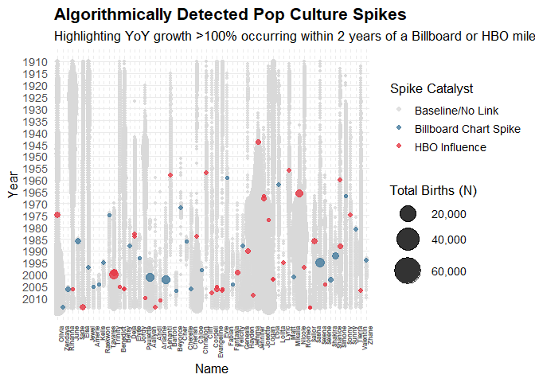
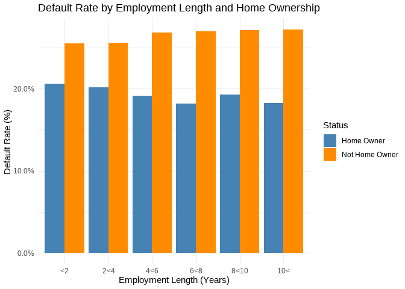
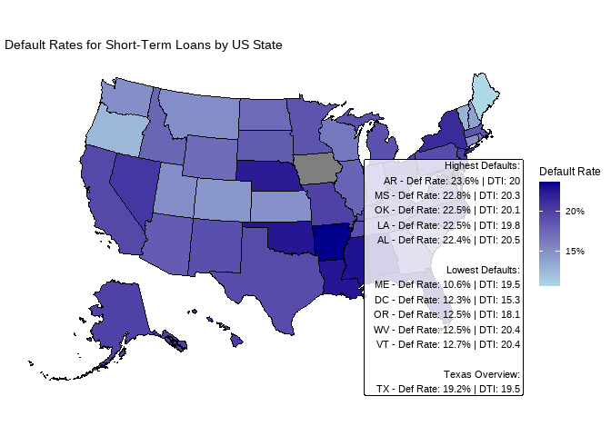
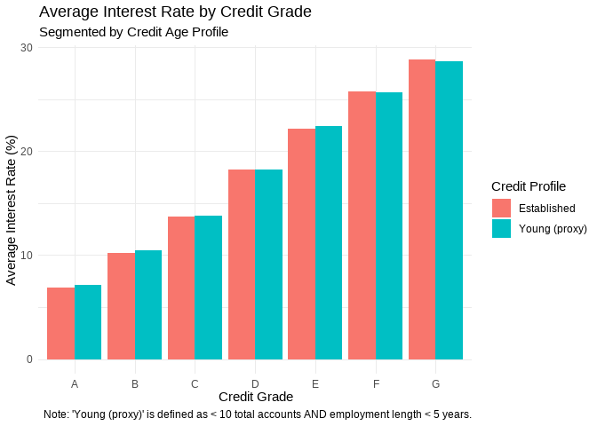
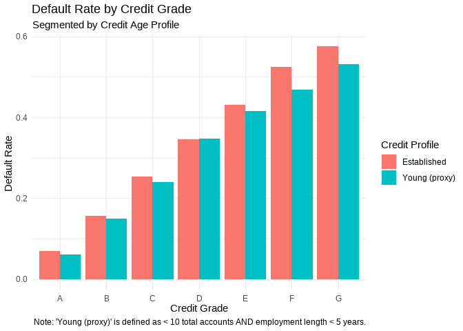
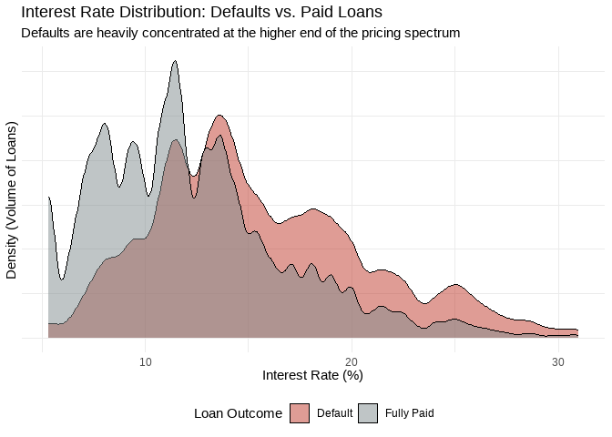
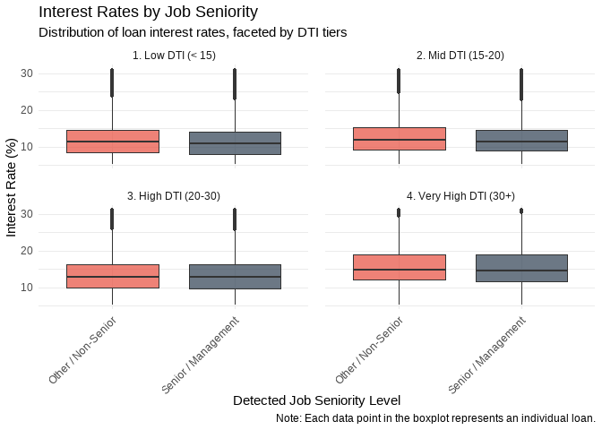

README
================
Martin Raubenheimer
2026-06-18

# 24954578

# Question 1

Categorizing coffees by matching the words SU students used to describe
coffee that they like to reviewer descriptions. - The function sets up
five default lists of coffee flavor words and collapses them into
regular expression search strings using the \| operator. - It merges
three separate description columns into a unified text field using
unite() and converts the entire text to lowercase using
str_to_lower(). - The str_count() function calculates the total number
of times category-specific keywords appear within each coffee’s combined
text. - It looks row-by-row to find the highest flavor score and uses
case_when() to assign a label based on that dominant trait.

Cleans and translates the map data. I used Claude to create a lookup
table for origin regions and country names that I can use that map
package.

    ## ⚠️  Unmapped values (extend region_to_country to fix):
    ##  - UNMAPPED: Kahale
    ##  - UNMAPPED: La Providencia
    ##  - UNMAPPED: Alaka District
    ##  - UNMAPPED: Campos Alto District
    ##  - UNMAPPED: Kula
    ##  - UNMAPPED: Northern Province
    ##  - UNMAPPED: Alto Jaramillo
    ##  - UNMAPPED: Yeri Growing Region
    ##  - UNMAPPED: Kibugu Village
    ##  - UNMAPPED: Cerro El Tigre
    ##  - UNMAPPED: Dolores
    ##  - UNMAPPED: El Socorro
    ##  - UNMAPPED: Ka’U Growing Region
    ##  - UNMAPPED: Ka’U
    ##  - UNMAPPED: Bella Vista
    ##  - UNMAPPED: Buenos Aires
    ##  - UNMAPPED: Central Province
    ##  - UNMAPPED: Los Planes
    ##  - UNMAPPED: Chito
    ##  - UNMAPPED: Chinas
    ##  - UNMAPPED: El Soccoro
    ##  - UNMAPPED: Los Angeles
    ##  - UNMAPPED: Finca Santa Teresa
    ##  - UNMAPPED: Sana’A Growing Region
    ##  - UNMAPPED: Sa’Dah Governorate
    ##  - UNMAPPED: Sana’A Governorate
    ##  - UNMAPPED: Cañas Verdes
    ##  - UNMAPPED: Jurutungo
    ##  - UNMAPPED: La Piedra De Rivas
    ##  - UNMAPPED: Ka‘Ū
    ##  - UNMAPPED: Ka‘Ū Growing Region
    ##  - UNMAPPED: Mirado Village
    ##  - UNMAPPED: Eastern Region
    ##  - UNMAPPED: Santa Maria
    ##  - UNMAPPED: Big Island Of Hawai’I
    ##  - UNMAPPED: Hawai’I
    ##  - UNMAPPED: “Big Island” Of Hawaii
    ##  - UNMAPPED: The Democratic Republic Of The Congo
    ##  - UNMAPPED: "Big Island" Of Hawai’I
    ##  - UNMAPPED: “Big Island” Of Hawai’I
    ##  - UNMAPPED: Big Island Of Hawai‘I
    ## 
    ## Saved → regions_with_countries.csv
    ## Columns added: country_1, country_2

Since most rating was the same I made fill average, rating per dollar
<!-- -->

I want to show how different coffee’s rating changed based roast and
price categories. - So filtered for the most famous roasts and
facet_wrapped on it. - Cost is important , so cost is on the x axis.
Cost is grouped in categories
<!-- -->

Now that we know that that there is a lot of highly rated coffees that
are very cheap, we need to find the sweet spot of quality and
affordability. - Just a normal scatter plot with rating on the x-axis
filtered for good quality ratings. - 5 cheapest options displayed per
rating, with cost on x-axis
<!-- -->

## Recommendation tables

I added these tables to provide the entrpreneur of a finite list of
options to choose from.

    ## [1] "figures/5cheap95.png"

    ## [1] "figures/5cheap96.png"

<!-- --><!-- -->

# Question 2

## Introduction

## Persistence analysis

- Combine any duplicate entries and ensure all names and genders are
  capitalized identically.
- Group the data by year and gender, sorting by count to assign a rank
  from 1 to $N$.
- Pull out only the Top 25 names for each year to serve as the baseline
  trend group.
- Look ahead 1, 2, or 3 years. Find where those original names sit in
  the future rankings. Assign a penalty rank to names that disappeared
  completely.
- Use Spearman correlation to assign a metric score ($\rho$) to each
  year’s endurance. Group them before and after 1990 to spot the
  historical shift. <!-- -->

## Popularity surges

-I took the Billboard and HBO datasets and extracted exactly one
critical year for each artist or character. For Billboard, we grouped
the data by artist and extracted the earliest year they hit their
absolute highest chart rank. This gave us a clean lookup table of “Pop
Culture Catalysts” and the year they occurred.

- I then looked at the baby names. Instead of just looking at raw
  numbers, the code used the lag() function to calculate the
  Year-over-Year (YoY) percentage growth for every single name.

- If a name grew by 5% or 10%, the algorithm ignored it.

- If a name grew by \>100% in a single year (and had at least 100 births
  to filter out statistical noise from rare names), the algorithm
  flagged that specific year as a “Spike.”

- Finally, the code joined the baby name data with the Event Ledger. It
  asked a specific question: Did this detected baby-name spike happen in
  the exact same year, or up to two years after, the artist/character
  peaked in the ledger?

If yes, the code assigned it a Red or Blue color. If no, it remained
Grey. <!-- -->

-I took the Billboard and HBO datasets and extracted exactly one
critical year for each artist or character. For Billboard, we grouped
the data by artist and extracted the earliest year they hit their
absolute highest chart rank. This gave us a clean lookup table of “Pop
Culture Catalysts” and the year they occurred.

- I then looked at the baby names. Instead of just looking at raw
  numbers, the code used the lag() function to calculate the
  Year-over-Year (YoY) percentage growth for every single name.

  - If a name grew by 5% or 10%, the algorithm ignored it.
  - If a name grew by \>100% in a single year (and had at least 100
    births to filter out statistical noise from rare names), the
    algorithm flagged that specific year as a “Spike.”

- Finally, the code joined the baby name data with the Event Ledger. It
  asked a specific question: Did this detected baby-name spike happen in
  the exact same year, or up to two years after, the artist/character
  peaked in the ledger?

If yes, the code assigned it a Red or Blue color. If no, it remained
Grey.

## Density

<!-- -->

## Genres

<!-- -->

# Question 3

## Home-owner v non Home owner

I wanted to generate a function that illustrates the differences in POD
for home owners and non-home owners, and young people versus old.

- different categories easily illustrate differences as well as
  different bars for home owners

- filtered for short-term loans
  <!-- -->

## State level

I like maps. Wanted to show how states differ so after the default rate
is calculated, “usmap” package installed, I only have to set
transparency by default rate. Default rates and DTI is calculated by
using summarise after grouped_by states

Hard numbers give a clear view so I added the tables of the states with
the 5 lowest and highest default rates and added there respective
average DTI’s.
<!-- -->

## Credit grades

I want to test the reliability of grades as indicators of defaults for
young people

- since there is no age column I had to make a proxy limiting the sample
  to total_acc \< 10 and emp_length \< 5.
- I made the y variable and input so that I can also learns something
  about interest rates
  <!-- -->
  <!-- -->

## Interest rates & Defaults

I wanted to visualise the difference between defaulted and paid loans by
interest rate, so I plotted the densities with interest rate on the
x-axis and fill with loan_status to visualise the difference
<!-- -->

## Does occupation names affect interest rates?

I just wanted to answer the director’s question to whether occupation
affects interest rates. - I made DTI categorical for facet_wrap - made a
dictionary for high level management positions and split the data based
on that using emp_title -Plotted the interest rate on y axis
<!-- -->
